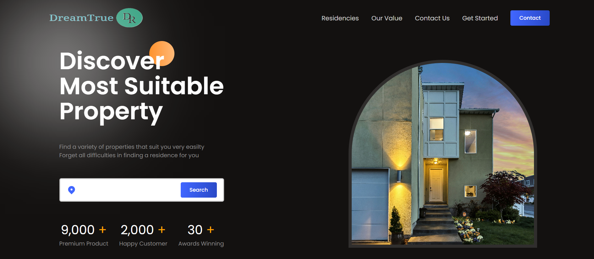
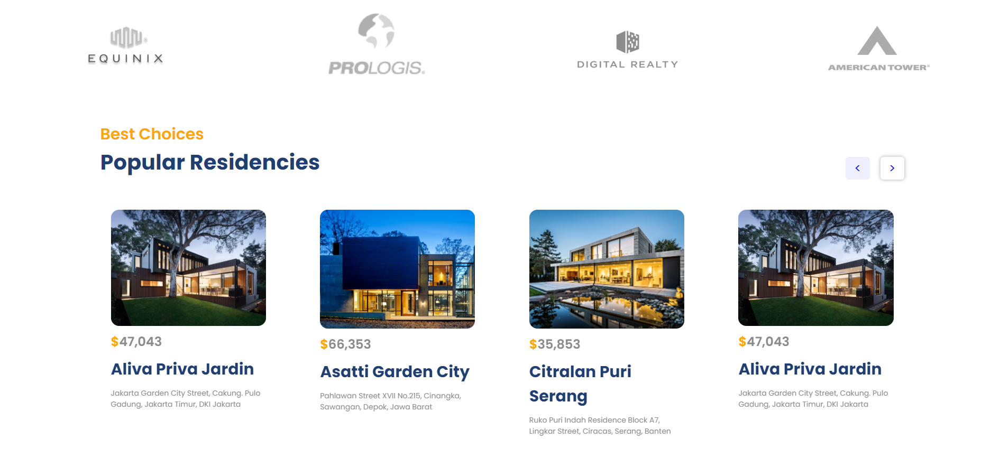

# Real-Estate
# MERN Full Stack Real Estate Website

Welcome to the **MERN Full Stack Real Estate Website** repository! This project is a fully functional real estate platform built using the MERN stack (MongoDB, Express.js, React.js, and Node.js). It allows users to browse, list, and manage real estate properties seamlessly.

---

## Features

### **Frontend**
- **Responsive Design**: Fully responsive UI using React.js with a modern and clean design.
- **Property Listings**: Browse, search, and filter properties based on price, location, and facilities.
- **Property Details**: Detailed pages for each listing, including images, descriptions, and facilities.
- **User Authentication**: Secure user registration and login system.
- **Dynamic Forms**: Add or edit properties with intuitive forms.

### **Backend**
- **RESTful API**: Robust and scalable API built with Node.js and Express.js.
- **JWT Authentication**: Secure access to user-specific data using JSON Web Tokens.
- **Real-Time Updates**: CRUD operations for property listings.

### **Database**
- **MongoDB**: Efficient and flexible NoSQL database for managing listings, users, and metadata.

---

## Technologies Used

### **Frontend**
- React.js
- Axios

### **Backend**
- Node.js
- Express.js
- bcrypt.js (for password hashing)
- JSON Web Tokens (JWT)

### **Database**
- MongoDB (with Mongoose ODM)

### **Other Tools**
- Git & GitHub for version control
- Postman for API testing

---

## Installation

1. Clone the repository:
   ```bash
   git clone [https://github.com/your-username/mern-real-estate.git](https://github.com/narutopandit/Real-Estate.git)
   ```

2. Navigate to the project directory:
   ```bash
   cd mern-real-estate
   ```

3. Install dependencies:
   - For the backend:
     ```bash
     cd backend
     npm install
     ```
   - For the frontend:
     ```bash
     cd ../frontend
     npm install
     ```

4. Set up environment variables:
   - Create a `.env` file in the `backend` folder.
   - Add the following:
     ```env
     PORT=8000
     MONGO_URI=your_mongodb_connection_string
     JWT_SECRET=your_jwt_secret
     ```

5. Start the development servers:
   - Backend:
     ```bash
     cd backend
     npm run dev
     ```
   - Frontend:
     ```bash
     cd ../frontend
     npm start
     ```

6. Open your browser and visit:
   ```
   http://localhost:3000
   ```

---

## Usage

- **For Users**:
  - Browse properties by city, price, or features.
  - View detailed information for each property.
  - Register and login to save favorites or post new listings.

- **For Admins**:
  - Manage property listings.
  - Approve or reject user submissions.

---

## Screenshots

### Home Page


### Property Details Page


---

## Contribution

Contributions are welcome! Please follow these steps:

1. Fork the repository.
2. Create a new branch:
   ```bash
   git checkout -b feature-name
   ```
3. Make your changes and commit them:
   ```bash
   git commit -m "Added new feature"
   ```
4. Push to your branch:
   ```bash
   git push origin feature-name
   ```
5. Open a pull request.

---

## License

This project is licensed under the MIT License. See the LICENSE file for details.

---

## Contact

- **Author**: Manish Kumar
- **Email**: narutopandit220@gmail.com
- **GitHub**: https://github.com/narutopandit

Feel free to reach out for any questions or feedback!

